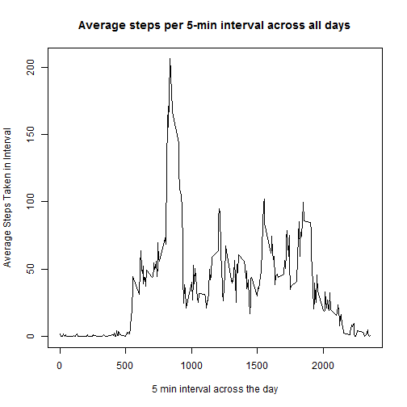
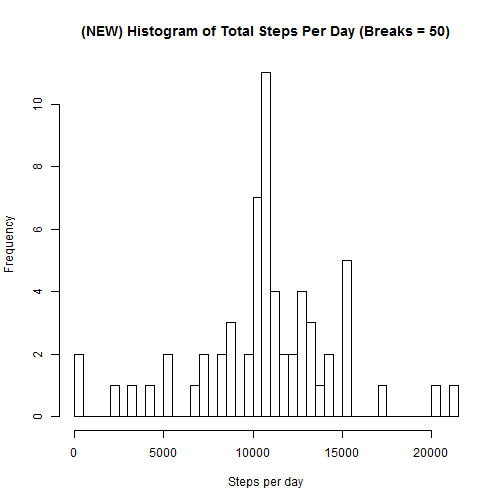

Reproducible Research Peer Assessment 1
========================================================
## What is the mean total number of steps taken per day?

#### 1. Calculate the total number of steps taken per day.


```r
activity <- read.csv ("C:\\Users\\ychen06\\Documents\\IDA MOOC\\Git\\RepData_PeerAssessment1\\activity\\activity.csv")
require(knitr)
opts_chunk$set(echo = TRUE, cache = TRUE, cache.path = "cache/", fig.path = "figure/")
library(plyr)
activity1<-na.omit(activity)
stepsday<- ddply(activity1,.(date),summarize,steps=sum(steps))
stepsday
```

```
##          date steps
## 1  2012-10-02   126
## 2  2012-10-03 11352
## 3  2012-10-04 12116
## 4  2012-10-05 13294
## 5  2012-10-06 15420
## 6  2012-10-07 11015
## 7  2012-10-09 12811
## 8  2012-10-10  9900
## 9  2012-10-11 10304
## 10 2012-10-12 17382
## 11 2012-10-13 12426
## 12 2012-10-14 15098
## 13 2012-10-15 10139
## 14 2012-10-16 15084
## 15 2012-10-17 13452
## 16 2012-10-18 10056
## 17 2012-10-19 11829
## 18 2012-10-20 10395
## 19 2012-10-21  8821
## 20 2012-10-22 13460
## 21 2012-10-23  8918
## 22 2012-10-24  8355
## 23 2012-10-25  2492
## 24 2012-10-26  6778
## 25 2012-10-27 10119
## 26 2012-10-28 11458
## 27 2012-10-29  5018
## 28 2012-10-30  9819
## 29 2012-10-31 15414
## 30 2012-11-02 10600
## 31 2012-11-03 10571
## 32 2012-11-05 10439
## 33 2012-11-06  8334
## 34 2012-11-07 12883
## 35 2012-11-08  3219
## 36 2012-11-11 12608
## 37 2012-11-12 10765
## 38 2012-11-13  7336
## 39 2012-11-15    41
## 40 2012-11-16  5441
## 41 2012-11-17 14339
## 42 2012-11-18 15110
## 43 2012-11-19  8841
## 44 2012-11-20  4472
## 45 2012-11-21 12787
## 46 2012-11-22 20427
## 47 2012-11-23 21194
## 48 2012-11-24 14478
## 49 2012-11-25 11834
## 50 2012-11-26 11162
## 51 2012-11-27 13646
## 52 2012-11-28 10183
## 53 2012-11-29  7047
```

#### 2. Make a histogram of the total number of steps taken each day.


```r
hist(stepsday$steps,breaks=50,main = "Histogram of Total Steps Per Day (Breaks = 50)", xlab = "Steps per day")
```

 


#### 3. Calculate and report the mean and median of the total number of steps taken per day.


```r
meanvalue <-mean(stepsday$steps,na.rm=TRUE)
medianvalue <- median(stepsday$steps, na.rm=TRUE)
```

The mean of the steps taken per day is 1.0766189 &times; 10<sup>4</sup> and the median is 10765.

## What is the average daily activity pattern?

#### 1. Make a time series plot of the 5-minute interval (x-axis) and the average number of steps taken, average across all days(y-axis).


```r
activity1 <- na.omit(activity)
int.steps <- ddply(activity1,.(interval),summarize,steps=mean(steps))
plotinterval <- plot(int.steps$interval,int.steps$steps,type="l",main ="Average steps per 5-min interval across all days", xlab = "5 min interval across the day", ylab = "Average Steps Taken in Interval")
```

 

```r
plotinterval
```

```
## NULL
```

#### 2. Which 5-min interval, on average across all days in the dataset, contains the maximum number of steps.


```r
int.steps <- arrange(int.steps,desc(steps))
max_int <-int.steps$interval[1]
max_int
```

```
## [1] 835
```

The maximum number of steps on average occurred in the 835 interval.

## Inputing missing values

#### 1. Calculate and report the total number of missing values in the dataset.

```r
NAValues <- sum(is.na(activity))
NAValues
```

```
## [1] 2304
```

The total numnber of missing values in the dataset is 2304.

#### 2. Devise a strategy for filling in all the missing values in the dataset.

All NAs will be replaced with the interval's mean value.

#### 3. Create a new dataset that is equal to the original set but with mssing data filled in.

```r
## Create additional column to show average of the interval.

newactivity <-merge(activity,int.steps, by="interval")

for (i in 1:nrow(activity)) {
  if (is.na(newactivity$steps.x[i])) {
    newactivity$steps.x[i] <- newactivity$steps.y[i]
  }
}

head(newactivity)
```

```
##   interval  steps.x       date  steps.y
## 1        0 1.716981 2012-10-01 1.716981
## 2        0 0.000000 2012-11-23 1.716981
## 3        0 0.000000 2012-10-28 1.716981
## 4        0 0.000000 2012-11-06 1.716981
## 5        0 0.000000 2012-11-24 1.716981
## 6        0 0.000000 2012-11-15 1.716981
```

#### 4. Create a new historgram of the total number of steps taken each day. Calculate and report the mean and median total number of steps taken per day. Do the values differ from the first part of the assignmet? What is the impact of imputtng missing data on the estimates of the total daily number of steps?


```r
newstepsday<- ddply(newactivity,.(date),summarize,steps=sum(steps.x))
new_histogram <- hist(newstepsday$steps,breaks=50,main = "(NEW) Histogram of Total Steps Per Day (Breaks = 50)", xlab = "Steps per day")
```

 

```r
new_histogram
```

```
## $breaks
##  [1]     0   500  1000  1500  2000  2500  3000  3500  4000  4500  5000
## [12]  5500  6000  6500  7000  7500  8000  8500  9000  9500 10000 10500
## [23] 11000 11500 12000 12500 13000 13500 14000 14500 15000 15500 16000
## [34] 16500 17000 17500 18000 18500 19000 19500 20000 20500 21000 21500
## 
## $counts
##  [1]  2  0  0  0  1  0  1  0  1  0  2  0  0  1  2  0  2  3  0  2  7 11  4
## [24]  2  2  4  3  1  2  0  5  0  0  0  1  0  0  0  0  0  1  0  1
## 
## $density
##  [1] 6.557377e-05 0.000000e+00 0.000000e+00 0.000000e+00 3.278689e-05
##  [6] 0.000000e+00 3.278689e-05 0.000000e+00 3.278689e-05 0.000000e+00
## [11] 6.557377e-05 0.000000e+00 0.000000e+00 3.278689e-05 6.557377e-05
## [16] 0.000000e+00 6.557377e-05 9.836066e-05 0.000000e+00 6.557377e-05
## [21] 2.295082e-04 3.606557e-04 1.311475e-04 6.557377e-05 6.557377e-05
## [26] 1.311475e-04 9.836066e-05 3.278689e-05 6.557377e-05 0.000000e+00
## [31] 1.639344e-04 0.000000e+00 0.000000e+00 0.000000e+00 3.278689e-05
## [36] 0.000000e+00 0.000000e+00 0.000000e+00 0.000000e+00 0.000000e+00
## [41] 3.278689e-05 0.000000e+00 3.278689e-05
## 
## $mids
##  [1]   250   750  1250  1750  2250  2750  3250  3750  4250  4750  5250
## [12]  5750  6250  6750  7250  7750  8250  8750  9250  9750 10250 10750
## [23] 11250 11750 12250 12750 13250 13750 14250 14750 15250 15750 16250
## [34] 16750 17250 17750 18250 18750 19250 19750 20250 20750 21250
## 
## $xname
## [1] "newstepsday$steps"
## 
## $equidist
## [1] TRUE
## 
## attr(,"class")
## [1] "histogram"
```

```r
newmeanvalue <-mean(newstepsday$steps)
newmedianvalue <- median(newstepsday$steps)
diffmeanvalue <- newmeanvalue-meanvalue
diffmedianvalue <- newmedianvalue-meanvalue
```

The new mean steps taken per day is 1.0766189 &times; 10<sup>4</sup> which is 0 from the original value.

The new median steps taken per day is 1.0766189 &times; 10<sup>4</sup> which is 0 from the original value.

## Are there differences in activity patterns between weekdays and weekends?

#### 1. Create a new factor variable in the dataset with two levels – “weekday” and “weekend” indicating whether a given date is a weekday or weekend day.


```r
newactivity$date <- as.Date(newactivity$date, "%Y-%m-%d")
newactivity$day<- weekdays(newactivity$date)
for (i in 1:nrow(newactivity)) {
  if (newactivity$day[i]=="Monday") {
    newactivity$day[i] <- "Weekday"
  }
  if (newactivity$day[i]=="Tuesday") {
    newactivity$day[i] <- "Weekday"
  }
   if (newactivity$day[i]=="Wednesday") {
    newactivity$day[i] <- "Weekday"
  }
   if (newactivity$day[i]=="Thursday") {
    newactivity$day[i] <- "Weekday"
  }
   if (newactivity$day[i]=="Friday") {
    newactivity$day[i] <- "Weekday"
  }
   if (newactivity$day[i]=="Saturday") {
    newactivity$day[i] <- "Weekend"
  }
   if (newactivity$day[i]=="Sunday") {
    newactivity$day[i] <- "Weekend"
  }
}
head(newactivity)
```

```
##   interval  steps.x       date  steps.y     day
## 1        0 1.716981 2012-10-01 1.716981 Weekday
## 2        0 0.000000 2012-11-23 1.716981 Weekday
## 3        0 0.000000 2012-10-28 1.716981 Weekend
## 4        0 0.000000 2012-11-06 1.716981 Weekday
## 5        0 0.000000 2012-11-24 1.716981 Weekend
## 6        0 0.000000 2012-11-15 1.716981 Weekday
```

#### 2. Make a panel plot containing a time series plot (i.e. type = "l") of the 5-minute interval (x-axis) and the average number of steps taken, averaged across all weekday days or weekend days (y-axis). 


```r
weekend<-subset(newactivity, newactivity$day =='Weekend')
weekday<-subset(newactivity,newactivity$day =='Weekday')

weekday_int <- ddply(weekday,.(interval),summarize,steps=mean(steps.x))
weekday_int$day <- "weekday"
weekend_int <- ddply(weekend,.(interval),summarize,steps=mean(steps.x))
weekend_int$day <- "weekend"
new_activity_day <- rbind(weekday_int, weekend_int)
library(lattice)

plot <- xyplot(new_activity_day$steps ~ new_activity_day$interval | new_activity_day$day, 
       layout = c(1, 2), type = "l", 
       xlab = "Interval", ylab = "Number of steps")

plot
```

 
